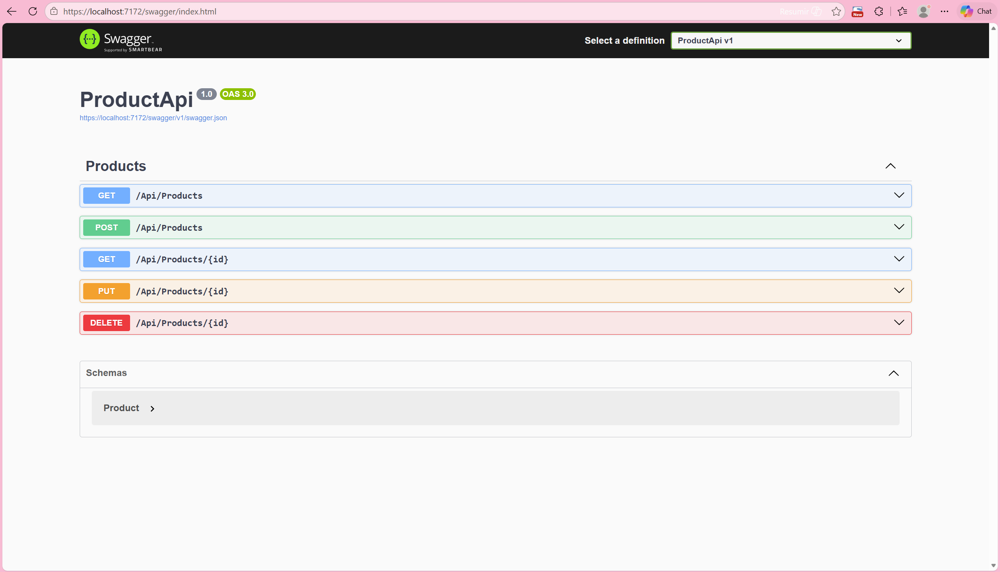
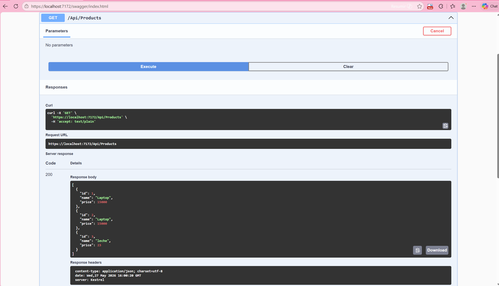
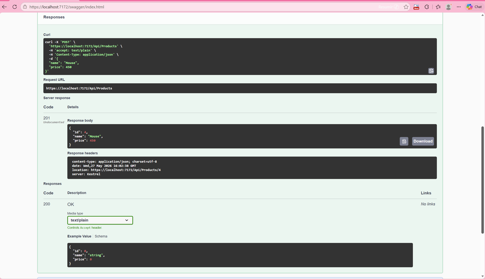
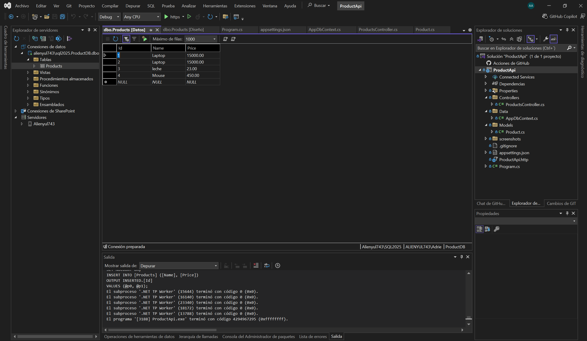

# CrudApi

RESTful ASP.NET Core Web API for product and inventory management using SQL Server and Entity Framework Core.

This project demonstrates a complete backend CRUD system built with professional backend development practices using ASP.NET Core, Entity Framework Core, and SQL Server integration.

---

# Features

* Create products
* Retrieve all products
* Retrieve products by ID
* Update existing products
* Delete products
* SQL Server database integration
* Entity Framework Core ORM
* Swagger/OpenAPI documentation
* RESTful architecture
* Dependency Injection
* Asynchronous database operations using async/await

---

# Technologies Used

* ASP.NET Core Web API
* C#
* Entity Framework Core
* SQL Server
* Swagger / OpenAPI
* Visual Studio
* Git & GitHub

---

# Project Architecture

The project follows a layered backend structure commonly used in enterprise applications.

```text id="y5dz91"
ProductApi
│
├── Controllers/
│   └── ProductsController.cs
│
├── Models/
│   └── Product.cs
│
├── Data/
│   └── AppDbContext.cs
│
├── screenshots/
│
├── Program.cs
├── appsettings.json
└── ProductApi.sln
```

---

# Database Integration

The API is connected to a SQL Server database using Entity Framework Core.

The `Products` table stores product information persistently and supports full CRUD operations through the API endpoints.

## Product Model

```csharp id="xj0v7r"
public class Product
{
    public int Id { get; set; }

    public string Name { get; set; }

    public decimal Price { get; set; }
}
```

---

# API Endpoints

| Method | Endpoint             | Description       |
| ------ | -------------------- | ----------------- |
| GET    | `/Api/Products`      | Get all products  |
| GET    | `/Api/Products/{id}` | Get product by ID |
| POST   | `/Api/Products`      | Create a product  |
| PUT    | `/Api/Products/{id}` | Update a product  |
| DELETE | `/Api/Products/{id}` | Delete a product  |

---

# Swagger Documentation

Swagger UI is enabled during development for interactive API testing.

## Swagger Home

```md id="m4q8px"

```

## GET Products Response

```md id="t9f0ab"

```

## POST Product Response

```md id="k2nv8q"

```

---

# SQL Server Database

The following image shows the SQL Server table storing product data successfully.

```md id="b1pz7x"

```

---

# Dependency Injection

The project uses Dependency Injection to register the database context inside `Program.cs`.

```csharp id="u3q9ld"
builder.Services.AddDbContext<AppDbContext>(options =>
    options.UseSqlServer(
        builder.Configuration.GetConnectionString("DefaultConnection")));
```

---

# Running the Project

## 1. Clone the repository

```bash id="fh8m1v"
git clone https://github.com/AdrielHa/CrudApi.git
```

## 2. Open the solution

Open:

```text id="v6rm0n"
ProductApi.sln
```

using Visual Studio.

---

## 3. Configure SQL Server connection

Update the connection string inside:

```text id="z4md8r"
appsettings.json
```

Example:

```json id="k7ta2d"
"ConnectionStrings": {
  "DefaultConnection": "Server=localhost\\SQL2025;Database=ProductDB;User Id=YOUR_USER;Password=YOUR_PASSWORD;TrustServerCertificate=True;"
}
```

---

## 4. Run the project

Press:

```text id="e1jk7f"
F5
```

or click:

```text id="v3u0sc"
Start Debugging
```

Swagger will open automatically.

---

# Learning Objectives

This project was built to practice:

* ASP.NET Core backend development
* REST API architecture
* SQL Server integration
* Entity Framework Core
* CRUD operations
* Dependency Injection
* Asynchronous programming
* API testing with Swagger

---

# Author

Adriel Yulissa Hernández Albarrán
Background in Physics with experience in:

* Scientific computing
* Data analysis
* Backend development
* Numerical modeling
* Experimental data visualization
